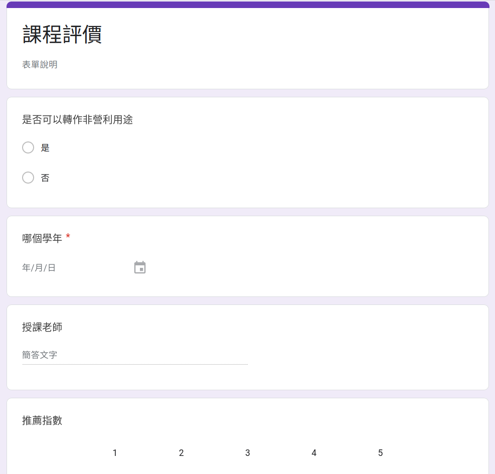
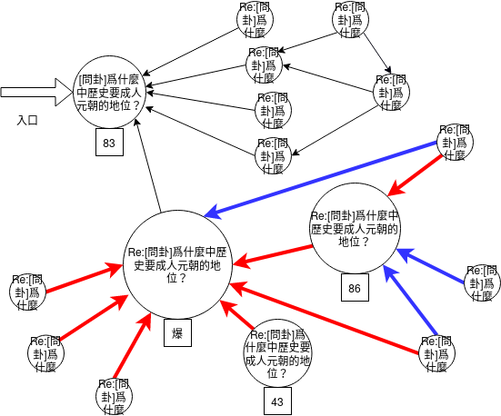

碳鍵之所以誕生就是因爲 PTT 太難用。

本文將講述碳鍵在文章系統上的兩大設計

- 結構
- 鍵結

是怎麽來的。

（以下談到的 PTT 的特點應該廣泛存在於各個 BBS 系統中，但鑑於現存有影響力的 BBS 只剩下 PTT 了，故以下皆以 PTT 代指）

（碳鍵中，擁有調整看板各項設定權限的統治集團稱爲執政黨，但底下先簡單循 PTT 的術語稱爲版主）
## PTT 分類模板
PTT 對某些特定分類提供了模板機制，以臺大的課程評價網爲例（下兩張圖）

可以看到它切分成了 1. 是否可以轉作其他非盈利用途 2. 那個學年 3. 授課教師 4. 系所與授課對象 5. 課程內容 6. 推薦指數 7. 上課用書 8. ...... 等等多個欄位。

然而，它本質上只是提供一份範本，再讓人修改而已，沒有防呆可能會讓人**漏填**或**誤刪**，也可能會填寫出**不合規範的資料**，例如日期填史前一萬年，推薦指數明明上限是五顆星硬要破表打十顆星。

而真的要發文的時候，那個模板真的不友善，我截個圖：

各種色碼影響視覺（ctrl-V 可以直接顯示色彩），頭兩行看完之後還要自己刪除。這種容錯性低的產品能夠存活到 2020 年，只能說是臺灣互聯網產業太不發達，缺乏競品與之對抗。

也因爲 PTT 文章的缺乏結構，我們無法針對某個欄位去做查詢，我們**無法查詢**推薦指數五顆星的課程到底有哪些.......

### 狄卡的解決方式
[2018 課程評價大募集！](https://www.dcard.tw/f/nctu/p/229424140)

一樣是靠複製範本，但狄卡的看板連分類都沒有。

怎麽可能會有效？

### 碳鍵的解決方式

對文章賦予結構，規定一個分類的文章必須擁有哪些欄位，各個欄位又必須符合什麼規範。

可以把它想做是一個問卷表單

在碳鍵，不論是版主要去設定欄位或是發文者發表文章，體驗都會跟 google 表單類似。

而由於賦予了結構，就不會有填錯的可能，也能夠依照欄位執行更複雜的搜尋。

TODO: 這邊補一張碳鍵的截圖

如果讀者懂一點程式的話，可以這樣類比：原本 PTT 是動態語言，碳鍵則是靜態語言，碳鍵爲文章加上了型別，不符合型別定義的文章（程式），都沒有辦法成功發佈（編譯）。

## PTT 的 Re:機制
這個 Re:機制是一個相當好的功能。一篇 Re: 也是一篇文章，它跟它所回覆的文章是同一個層級的，一篇 Re: 可以再被留言，也可以再被回覆。

然而，光是 Re: 並無法表達出文章之間的複雜關係，我們僅能知道 Re: 同一個主題的文章屬於同一個討論串而已，對於討論串之中的文章，它們是在互相攻訐，還是互相吹捧，還是說根本主題已經轉移了，我們一無所知。

舉個例子：

這個討論串原本是在討論歷史問題，但有名覺青胡亂歸因到中文的語法問題，點燃了戰火，以致於後續有多篇回文討論起了語言學，它們之間有的互相支持，有的各持立場，而少部分仍在討論歷史，但 PTT 簡單的 Re: 機制並無法表示出這些關係，身在戰火中心的人想要知曉新文章的立場／意圖爲何，只能一篇一篇點進去看。

### 狄卡的解決方法

狄卡只能用留言討論，功能更差。

### 碳鍵的解決方法

作者在發文時，可以畫出多個鍵結，以指明它與其他文章的關係。如此，除了條列式地顯示文章標題，可以進一步以圖形介面表示一個討論串之內的鍵結關係。

以下是圖示：

紅色代表反對，藍色代表支持，黑色則代表無特別立場（這些立場都可以由版主去設定、擴充）。 我們可以很容易看到右上角跟下半部顯然已經在討論不同的主題了，並且下半部正發生激烈的爭辯。

注意到，這些鍵結是**文章的作者主動畫的**，爲什麼作者會想要畫？主要是爲了表達立場，怒不可遏想戳人的時候，總是想戳的更痛，想讓看倌也知道某個傢伙的言論多誇張。

以資料結構來比喻，PTT 的討論串就只是個串列（ list ），而碳鍵則是一張圖（ graph ），兩者能夠表達的資訊有若天壤之別，圖可以退化爲串列，但串列萬萬表達不了圖。

## PTT 的其他問題
資深用戶習慣快捷鍵跟操作邏輯之後可能會覺得還不賴，但客觀來說對新手實在很不友善。PTT 的操作有些地方非常原始，最深層的因素在於 PTT 是以純文字組成的，比如說：

- 前面提到的模板機制
- 要回覆留言居然得打開一篇文章直接改
  - 我沒有去看源碼但合理懷疑 PTT 就是把文章跟留言存成一個檔案，回覆留言的時候直接去改檔案...
- 數學公式跟程式碼顯示困難
  - 以前看到考古題都覺得作者太辛苦了，譬如說這篇隨便找的[微積分考古](https://www.ptt.cc/man/NTU-Exam/DE0A/D245/D299/DDC7/D9B9/D4A6/M.1258555972.A.5BA.html)，它這個定積分的符號應該就打了很久...更複雜的數學符號鐵定更痛苦。

透過賦予結構，以及採用較現代的 Web 技術，這些問題碳鍵都能解決。

這裏再稍微討論一下，PTT 非營利，聽起來似乎很高尚，但天下熙熙攘攘，都是爲了利益，這樣的非營利組織在維護與開發上不免顯得鬆散，例如幹出禁止註冊這種昏招、當機或維修就直接停擺數天。

## 狄卡總論

狄卡的文章系統十分簡單，所有功能就是1. 發表文章 2. 在文章下面留言，沒了。硬要再加一個的話，3. 文章可以歸到某些話題，但也就是打標籤（tag）罷了。

綜上所述，狄卡的討論功能對 PTT 並無優勢，之所以能不斷佔領 PTT 的市場份額，憑藉的是現代易用的介面跟操作。

## 更多

碳鍵還有其他創新，例如外掛系統、政黨系統等等。本篇只是說明了文章系統的發想過程而已，省略了許多細節，有些讀者可能已經產生一些疑問，例如說「碳鍵中的 Re: 也是一種分類嗎？」

這端看版主如何設計。碳鍵中的分類與鍵結密切相關，它們有很多組合玩法！完整介紹請見[碳鍵指南](./指南.md)。