# 架構

碳鍵的 [docker-compose.yml](https://github.com/carbon-bond/carbonbond/blob/master/deploy/docker-compose.yml) 設定中包含四個 docker 容器，分別是 postgres, redis, frontend, api-service。

其中的 frontend，是 Nginx 官方容器加上靜態檔案以及 [Nginx 設定檔](https://github.com/carbon-bond/carbonbond/blob/master/frontend/app/web/deploy/nginx.conf)，它監聽於 80 埠口，是瀏覽器直接接觸的容器，當收到請求時，frontend 會做兩件事情：

- 若是靜態檔案請求，返回檔案內容
- 若是 API 請求，將請求反向代理給 api-service

